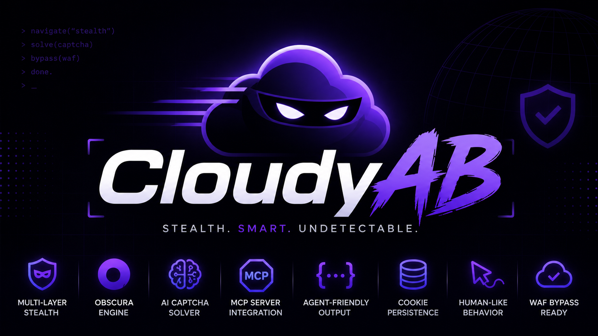

# CloudyAB

<p align="center">
  
</p>

Stealth headless browser with MCP support and AI captcha solving.

CloudyAB bypasses Cloudflare, AWS WAF, and other anti-bot protections using a multi-layer architecture: fast HTTP-level stealth for simple pages, automatic escalation to a full browser engine for JavaScript-heavy sites, and AI-powered captcha solving when challenges are detected.

## Features

- **Stealth HTTP layer** — TLS fingerprint spoofing (JA3/JA4), Cloudflare JS challenge solving via embedded JS interpreter
- **Browser engine** — CDP-based headless browser with anti-detection script injection (navigator, WebGL, canvas, plugins spoofing)
- **Auto-escalation** — starts with fast HTTP, automatically escalates to browser when protection requires it
- **AI captcha solving** — local ONNX models for text OCR, image classification, and slider puzzles
- **AI browsing agent** — give it a natural language goal, it navigates autonomously using an LLM
- **MCP server** — 8 tools exposed via Model Context Protocol for AI agent integration
- **HTTP task queue** — async API with webhook callbacks for long-running operations
- **Fully configurable** — TOML config file, enable/disable any subsystem, set API keys

## Quick Start

```bash
# Build
cargo build --release

# Generate default config
./target/release/cloudyab --init

# Edit config (set API keys, enable/disable features)
# Then run the MCP server:
./target/release/cloudyab
```

## Configuration

CloudyAB loads configuration from `cloudyab.toml` (or path in `CLOUDYAB_CONFIG` env var). See `cloudyab.example.toml` for all options.

Key sections:

```toml
[engine]
auto_escalate = true    # HTTP → browser on failure
timeout_secs = 30

[stealth_http]
enabled = true

[browser]
enabled = true
# binary_path = "/path/to/obscura"  # Or set CLOUDYAB_BROWSER_BIN

[solver]
enabled = true
models_dir = "models"

[ai]
enabled = true
provider = "openai"
api_key = "sk-..."
model = "gpt-4o-mini"

[proxy]
url = "socks5://127.0.0.1:1080"
```

## MCP Tools

| Tool | Description |
|------|-------------|
| `navigate` | Navigate to a URL with stealth protection bypass |
| `snapshot` | Get page accessibility tree with @eN element refs |
| `click` | Click an element by ref |
| `fill` | Fill a text input by ref |
| `type_text` | Type with realistic keystroke timing |
| `screenshot` | Capture page as PNG |
| `get_cookies` | Extract session cookies |
| `ai_browse` | Autonomous AI-powered browsing for a goal |

## HTTP Task Queue API

Runs on port 9222 alongside the MCP server.

```bash
# Submit a task (returns immediately with task_id)
curl -X POST http://localhost:9222/tasks \
  -H "Content-Type: application/json" \
  -d '{
    "url": "https://example.com",
    "snapshot": true,
    "cookies": true,
    "webhook_url": "https://your-server.com/callback"
  }'

# Poll task status
curl http://localhost:9222/tasks/<task_id>

# Health check
curl http://localhost:9222/health
```

## Architecture

```
┌─────────────────────────────────────────────────┐
│              MCP Server (stdio)                  │
│              HTTP Task Queue (:9222)             │
├─────────────────────────────────────────────────┤
│              Orchestrator (core)                 │
│         auto-escalation + captcha detect        │
├──────────────────┬──────────────────────────────┤
│  Stealth HTTP    │    Browser Engine (CDP)      │
│  (Layer 1)       │    (Layer 2)                 │
│  TLS spoofing    │    Stealth scripts           │
│  JS challenges   │    Full rendering            │
├──────────────────┴──────────────────────────────┤
│  Captcha Solver  │  Cookie Store  │  Human Sim  │
│  ONNX models     │  SQLite        │  Bézier     │
└──────────────────┴──────────────────────────────┘
```

## Crate Structure

| Crate | Purpose |
|-------|---------|
| `cloudyab-types` | Shared types, DTOs, enums (zero deps) |
| `cloudyab-core` | Orchestration, routing, config, traits |
| `cloudyab-stealth-http` | TLS fingerprinting + JS challenge solver |
| `cloudyab-browser` | CDP browser engine with stealth injection |
| `cloudyab-solver` | ONNX captcha AI (text, image, slider) |
| `cloudyab-cookies` | SQLite cookie persistence |
| `cloudyab-human` | Bézier mouse, realistic keyboard, scroll |
| `cloudyab-snapshot` | Accessibility tree → JSON with @eN refs |
| `cloudyab-server` | MCP binary that wires everything together |

## Requirements

- Rust 1.75+
- A CDP-compatible browser binary for full browser mode (set `browser.binary_path` or `CLOUDYAB_BROWSER_BIN`)
- ONNX model files in `models/` directory for captcha solving (optional)
- OpenAI API key for AI browsing (optional)

## License

MIT
